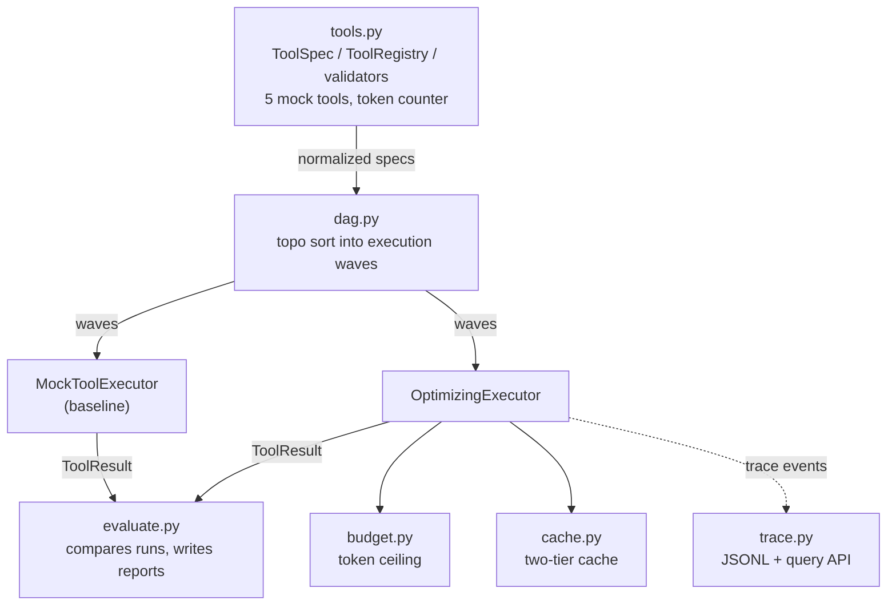

# P4: MCP execution and token optimization

A small experiment in optimizing tool-using LLM pipelines for cost, latency,
and success rate. A pipeline compiles into an execution DAG. An optimizing
executor adds token budgeting and a two-tier cache (exact plus similarity) on
top of a plain baseline, and an eval script measures the difference.

Pure stdlib, fully deterministic, no API calls. The tools and data are made up
(`TOOL_A` through `TOOL_E`) so the whole thing reproduces byte for byte.

## Architecture



See `docs/architecture.md` for the full data flow and a sample pipeline DAG.

## What's where

- `src/tools.py`: tool specs, validation, the token counter, and the five mock tools
- `src/dag.py`: the DAG. Nodes are calls, edges are `$ref` dependencies, topo-sorted into waves
- `src/executor.py`: `MockToolExecutor` (baseline) and `OptimizingExecutor` (cache, budget, logging)
- `src/budget.py`: per-pipeline token ceiling, allocation, truncate/skip
- `src/cache.py`: exact-match cache plus a deterministic similarity fallback
- `src/trace.py`: structured JSONL trace and a query API
- `src/evaluate.py`: runs baseline vs optimized and writes the reports
- `src/orchestrator.py`: resolves `$ref` inputs, runs the DAG, CLI entry point

## Running it

```bash
# from this directory; src/ and shared/ need to be importable
export PYTHONPATH="$PWD"          # PowerShell: $env:PYTHONPATH = "$PWD"

python -m src.orchestrator                  # baseline
python -m src.orchestrator --optimize       # cache + budget
python -m src.orchestrator --optimize --log logs/trace.jsonl

python -m src.evaluate                       # writes eval/COMPARISON.md etc.

python -m pytest tests -q
```

Seed, budget, and the cache threshold live in `config.json`.

## Demonstration

Running the optimized executor over the three sample pipelines:

```bash
export PYTHONPATH="$PWD"
python -m src.orchestrator --optimize
```

produces:

```json
{"cache_hits": 1, "node_count": 5, "optimized": true, "pipeline": "linear", "statuses": {"ok": 5}, "success_rate": 1.0, "total_latency_ms": 121.0, "total_tokens": 208}
{"cache_hits": 4, "node_count": 4, "optimized": true, "pipeline": "branching", "statuses": {"ok": 4}, "success_rate": 1.0, "total_latency_ms": 4.0, "total_tokens": 104}
{"cache_hits": 1, "node_count": 4, "optimized": true, "pipeline": "converging", "statuses": {"ok": 4}, "success_rate": 1.0, "total_latency_ms": 126.0, "total_tokens": 164}
```

The `branching` pipeline repeats `TOOL_A(query="alpha")` from an earlier
pipeline in the shared cache, so 4 of its 4 nodes hit and it finishes in 4ms
instead of paying full latency for every call.

Running `python -m src.evaluate` aggregates baseline vs optimized across all
three pipelines and writes `eval/COMPARISON.md`. Current numbers: 28.1% token
reduction, 36.46% latency reduction, cache hit rate 0.4615, success rate 1.0
on both paths. Under a budget squeezed to 1/8 of normal, the optimized path
still finishes every pipeline within the ceiling.

## Metrics

`token_reduction_pct`, `latency_reduction_pct`, `success_rate`, `cache_hit_rate`,
and success rate under a tight budget. Formulas are in `docs/metrics.md`, the
actual numbers in `eval/COMPARISON.md`.

## Outputs

- `logs/trace.jsonl`: one event per tool execution
- `eval/*.json`, `eval/COMPARISON.md`, `eval/SUMMARY.md`: benchmark results

Everything is seed-locked (`shared/determinism.py`). `tests/test_determinism.py`
checks the metrics come out the same across repeated runs.

## Writing hygiene

`scripts/check_prose.py` scans tracked markdown and source comments for
em-dashes and leftover tool-call XML fragments that sometimes slip in from
AI-assisted editing. It's stdlib-only and not wired into any git hook, so run
it by hand when you want a check: `python scripts/check_prose.py`.
