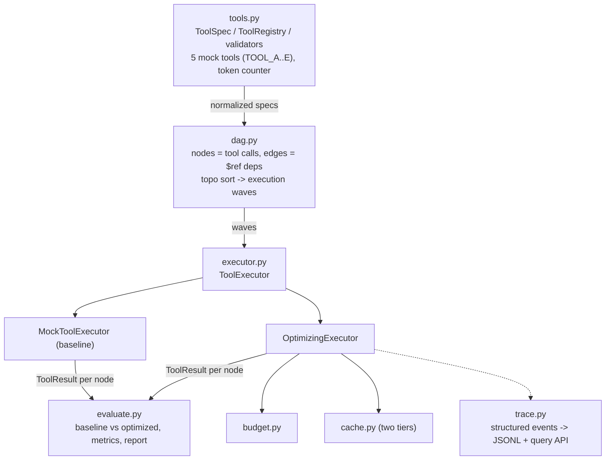
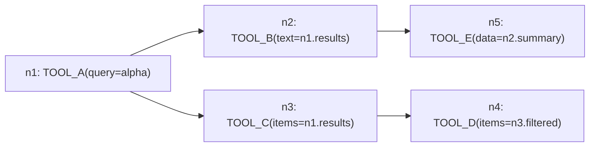

# Architecture

## The problem

Tool-using LLM pipelines repeat work and blow through token budgets. This models
a pipeline as a DAG of tool calls and optimizes cost, latency, and success
against an unoptimized baseline. Everything is synthetic and deterministic, so
a run is reproducible.

## How the pieces fit

## Sample "linear" pipeline

Waves: `[[n1], [n2, n3], [n4, n5]]`. Nodes in the same wave have no dependency
on each other, so they could run together.

## What the optimized path does, per node

1. Budget gate. `TokenBudget.request()` returns ok, truncated, or skipped. Once
   the budget is gone, the remaining nodes are skipped instead of crashing.
2. Cache lookup. Exact match first (hash of tool plus inputs), then similarity
   (hashing embedding, cosine over the threshold). A hit reuses the output, so
   there's no regeneration and the tokens and latency are saved.
3. Execute, then truncate string outputs to the granted slice if the grant was
   only partial.
4. Log one event with the optimization fields in its meta.

The cache is shared across the whole eval suite, so a repeated
`TOOL_A(query="alpha")` in a later pipeline hits a result cached earlier. That's
where most of the savings come from.

## Data types

- `ToolSpec`: id, input/output spec, estimated_tokens, latency, success rate
- `ToolResult`: output, tokens_used, latency_ms, status, cache_hit, cache_kind
- `RunResult`: per-node results plus totals
